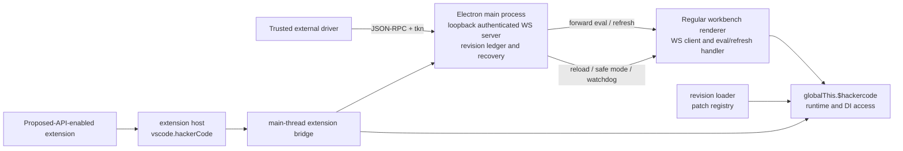

# HackerCode runtime patch foundation

HackerCode is a privileged foundation for loading, selecting, refreshing, recovering, and promoting runtime patches in the desktop workbench. A patch is JavaScript source evaluated as a real ESM module; it is not a source diff and is not translated into TypeScript.

This foundation deliberately does **not** implement an agent workflow. It provides control and extension surfaces from which a trusted driver or a proposed-API-enabled extension can build a workflow. It also does not promise that arbitrary patches are safe, that every mutation is reversible, or that recovery can make the application unbrickable.

## Read this first

- [Architecture, component map, security, and recovery](architecture.md)
- [Patch authoring and refresh](patch-authoring.md)
- [JSON-RPC protocol and proposed extension API](protocol-and-api.md)
- [Operations, promotion, validation, and troubleshooting](operations.md)

The implementation is desktop-only. The regular workbench imports the contribution from `src/vs/workbench/workbench.desktop.main.ts`; session/Agents windows are excluded from renderer registration and from main-owned patch reloads.

## Mental model

1. The Electron main process owns durable revision state, patch storage, baseline checks, promotion, safe-mode decisions, boot monitoring, and the authenticated loopback WebSocket server.
2. Each eligible renderer connects **outbound** to that server, registers its window ID, and handles forwarded `eval` and `refresh` requests.
3. The regular workbench installs immutable `globalThis.$hackercode` in development builds, or in built products started with `--hackercode-control`. The global exposes the workbench instantiation service, service discovery, and refresh helpers.
4. Revision patch sources are compiled with a Blob URL and dynamic `import()`. Each module must default-export an async-capable patch factory.
5. The patch registry owns reversible mutations made through its context. A set change first reverts the old set, applies the new ordered set, and attempts to restore the old set if the target fails.
6. “Pristine” means the source baseline **including** source-controlled promoted layers. Emergency safe mode additionally sets `skipPromoted`, which is the no-patch bypass.



The renderer is the WebSocket **client** because the main process already owns the privileged listener, token lifecycle, window registry, durable state, and recovery. This also avoids placing an unauthenticated or independently discoverable server in every renderer. The extension path cannot be the only recovery path: a bad renderer patch can prevent the workbench or extension host bridge from becoming usable, while the main process must still be able to quarantine state and reload a window.

## Trust summary

Treat the WebSocket token as root authority over the running HackerCode instance. A holder can intentionally execute arbitrary JavaScript in a renderer, resolve powerful services, change revisions, reload windows, enter safe mode, and, in a source checkout, request promotion.

- The endpoint binds only to `127.0.0.1` on an ephemeral port.
- Endpoint metadata is written to `<user-data-dir>/hackercode/control.json`; the file is created and chmodded to mode `0600`, and its directory is restricted to `0700` where POSIX modes are supported.
- The token is a random 32-byte base64url value, accepted through the WebSocket `tkn` query parameter, and compared with a timing-safe equality check.
- Control mode is on by default for development (`!isBuilt`). A built product requires `--hackercode-control`.
- Renderer evaluation with a Blob-backed ESM async function is intentionally unsafe. The module specifier and protected-object guards reduce accidental damage to the control plane; they are **not** a sandbox or a general authorization boundary.
- Workspace Trust does not gate or protect this core surface. Proposed API checks gate which extensions receive `vscode.hackerCode`, but a token holder already has the stronger WebSocket authority.

Never log, paste, check in, or place a real token in documentation or diagnostics. Examples in these documents use visibly fake values.

## State and storage at a glance

The main process persists the ledger under the state-service key `hackercode.revisionLedger.v1`. Revision content is stored under:

```text
<user-data-dir>/hackercode/
├── control.json
└── revisions/
    └── <64-character revision id>/
        ├── manifest.json
        ├── patch-0000.txt
        └── ...
```

Revision and patch IDs are content-addressed with SHA-256. Stored patch bytes are verified against each descriptor’s `size` and `sha256` before loading.

Promoted layers live in:

```text
src/vs/workbench/contrib/hackercode/browser/promoted/
├── manifest.json
└── <patch sha256>.js
```

When `out/vs/workbench/contrib/hackercode/browser/promoted/` already exists during source-checkout promotion, the main process attempts to mirror the bundle there. A mirror failure is logged but does not undo the source update.

## Current public entry points

- Command Palette: **HackerCode: Select Revision...**
- Status bar: `HackerCode: Pristine`, `HackerCode: latest`, or a short revision ID
- External JSON-RPC methods: `getState`, `listRevisions`, `createRevision`, `setRevision`, `safeMode`, `reload`, `promote`, `eval`, and `refresh`
- Proposed extension namespace: `vscode.hackerCode`
- Development global: `globalThis.$hackercode`
- Startup switches: `--hackercode-control` and `--hackercode-safe-mode`
- Development pre-workbench recovery shortcut: Ctrl+Shift+Alt+R on Windows/Linux, Cmd+Shift+Alt+R on macOS

See [operations.md](operations.md) for the shortcut’s exact availability and the complete recovery procedure.
