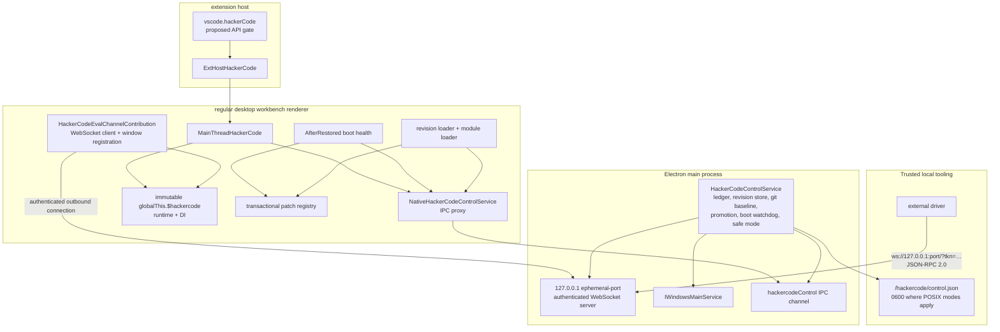

# Architecture, security, and recovery

## Process architecture



### Why main serves and renderer connects

The main process is the only layer that can keep recovery independent of renderer health. It owns:

- the durable ledger and revision files;
- the authenticated endpoint and token metadata;
- the authoritative list of eligible workbench windows;
- reload and native recovery-dialog control;
- boot watchdogs and stale-boot detection;
- git baseline checks and source-checkout promotion.

Making the renderer a client gives each healthy workbench a replaceable connection while leaving the listener and recovery authority outside patchable renderer code. A renderer registers with `$/hackerCode/registerRenderer` after connecting. The main process validates that the window is a regular workbench, replaces any older registration for that window, and routes `eval`/`refresh` to an explicit `windowId` or the focused window.

The renderer reconnects with exponential delay from one to 30 seconds. Main-to-renderer requests time out after 30 seconds; registration times out after ten seconds.

### Why the extension bridge is not recovery

The proposed extension path is:

```text
extension
  -> vscode.hackerCode
  -> ExtHostHackerCode
  -> MainThreadHackerCode
  -> renderer IPC proxy / renderer runtime
  -> main HackerCodeControlService
```

It is useful for trusted automation already running as an extension. It cannot be the sole recovery path because a bad patch can stop workbench restoration, prevent extension activation, block the main-thread bridge, or freeze the renderer event loop. Recovery state and reload ownership therefore remain in main. The command-line switch and external WebSocket can act without an extension; the stale-boot check happens when the main service is constructed.

## Component and file map

### Platform common

| File | Current responsibility |
| --- | --- |
| `src/vs/platform/hackercode/common/hackerCode.ts` | Service contract; revision, patch, promoted-layer, boot, quarantine, and state types; pristine constant; ledger normalization, selection, quarantine, health, boot, safe-mode, and promotion-reset transitions. |
| `src/vs/platform/hackercode/common/hackerCodeControlProtocol.ts` | Plain JSON-RPC method strings, request/response types, 256 KiB eval wire limit, error codes, strict outer parameter validation, and renderer registration method. |
| `src/vs/platform/environment/common/argv.ts` | Parsed argument types for `--hackercode-control` and `--hackercode-safe-mode`. |
| `src/vs/platform/environment/node/argv.ts` | CLI option registration and user-facing switch descriptions. |

### Platform main and Node

| File | Current responsibility |
| --- | --- |
| `src/vs/platform/hackercode/electron-main/hackerCodeControlService.ts` | Main authority: state-service ledger, on-disk revision store, SHA-256 verification, git baseline checks, promotion, loopback WebSocket server, token metadata, renderer routing, reload, boot watchdog/heartbeats/dialog, and safe mode. |
| `src/vs/platform/hackercode/node/hackerCodePromotion.ts` | Promoted manifest validation, content-addressed `.js` files, atomic-ish bundle staging, git HEAD lookup, and path-limited `git add`/`git commit --only`. |
| `src/vs/code/electron-main/app.ts` | Instantiates/proxies the main service and handles `vscode:hackercodeSafeMode` from the bootstrap keyboard shortcut. |

### Platform browser and renderer proxy

| File | Current responsibility |
| --- | --- |
| `src/vs/platform/hackercode/electron-browser/hackerCodeControlService.ts` | `NativeHackerCodeControlService`, a proxy to main’s `hackercodeControl` IPC channel. |
| `src/vs/platform/hackercode/browser/hackerCodeRuntime.ts` | Enables the privileged runtime in development or explicit built control mode; installs immutable `globalThis.$hackercode`; exposes service listing/resolution, DI invocation, and refresh. |
| `src/vs/platform/hackercode/browser/hackerCodeControlEval.ts` | Executes intentionally unsafe async-function bodies with `runtime`, `instantiationService`, `getService`, and `refresh`; invokes bounded serialization. |
| `src/vs/platform/hackercode/browser/hackerCodeControlSerializer.ts` | Converts eval results to bounded JSON-safe values without invoking getters; defaults to depth 6, breadth 100, and 1 MiB output. |
| `src/vs/platform/hackercode/browser/hackerCodeRefresh.ts` | Renderer refresh and guarded module-loader service interfaces. |
| `src/vs/workbench/browser/workbench.ts` | Enables hot reload and installs `globalThis.$hackercode` before workbench layout when control mode is enabled. |
| `src/vs/code/electron-browser/workbench/workbench.ts` | Installs the development bootstrap key listener before importing the workbench and sends the safe-mode IPC message. |

### Workbench implementation

| File | Current responsibility |
| --- | --- |
| `src/vs/workbench/contrib/hackercode/browser/hackercode.contribution.ts` | Imports all HackerCode workbench registrations. |
| `src/vs/workbench/contrib/hackercode/browser/hackerCodeRevisionLoader.ts` | Validates module specifiers; evaluates patch source as Blob-backed ESM; loads promoted and selected layers; tracks imported module namespaces; implements soft/module/hard refresh. Its `BlockStartup` contribution requests a delayed refresh service, whose real construction is scheduled for global idle or forced by first property access. |
| `src/vs/workbench/contrib/hackercode/browser/hackerCodePatchRegistry.ts` | Patch context and ordered patch-set convergence; reversible property/method/disposable/command/status-bar operations; rollback and previous-set restoration. |
| `src/vs/workbench/contrib/hackercode/browser/hackerCodePatchProtection.ts` | Weak-set brand for known HackerCode runtime/control objects; a narrow guard, not a sandbox. |
| `src/vs/workbench/contrib/hackercode/browser/hackerCodeEvalChannel.ts` | Authenticated renderer WebSocket client, registration, reconnect, and renderer-side `eval`/`refresh` handlers. |
| `src/vs/workbench/contrib/hackercode/browser/hackerCodeBootHealth.ts` | After-restoration boot attempt, two-second renderer heartbeats, revision-readiness/frame wait, healthy completion, and renderer-error safe-mode fallback. |
| `src/vs/workbench/contrib/hackercode/browser/hackerCodeVersionConstants.ts` | `workbench.action.hackerCode.selectRevision` command ID. |
| `src/vs/workbench/contrib/hackercode/browser/hackerCodeVersionModel.ts` | Quick-pick and status-bar presentation, including quarantine/current/latest/pristine labels. |
| `src/vs/workbench/contrib/hackercode/browser/hackerCodeVersionPicker.ts` | Revision selection and source-checkout promotion UI. |
| `src/vs/workbench/contrib/hackercode/browser/hackerCodeVersionStatus.ts` | Right-aligned revision status entry at priority 99. |
| `src/vs/workbench/contrib/hackercode/browser/promoted/manifest.json` | Source-controlled promoted-layer manifest; currently schema version 1. |
| `src/vs/workbench/workbench.desktop.main.ts` | Imports the desktop HackerCode contribution and native renderer proxy. |

### Proposed extension API

| File | Current responsibility |
| --- | --- |
| `src/vscode-dts/vscode.proposed.hackerCode.d.ts` | Proposed `vscode.hackerCode` public types and methods. |
| `src/vs/platform/extensions/common/extensionsApiProposals.ts` | Registers the generated `hackerCode` proposal name. |
| `src/vs/workbench/api/common/extHost.api.impl.ts` | Creates the namespace and enforces `checkProposedApiEnabled(extension, 'hackerCode')` per call. |
| `src/vs/workbench/api/common/extHostHackerCode.ts` | Extension-host forwarding wrapper. |
| `src/vs/workbench/api/common/extHost.protocol.ts` | Main-thread RPC shape and `MainThreadHackerCode` proxy identifier. |
| `src/vs/workbench/api/browser/mainThreadHackerCode.ts` | Renderer-side API bridge, control-mode check, window targeting, local eval, refresh, and active-revision promotion. |
| `src/vs/workbench/api/browser/extensionHost.contribution.ts` | Registers the main-thread customer by importing `mainThreadHackerCode`. |

## Security and trust model

### Authority boundaries

The token in `control.json` is **root authority** for this deliberately privileged surface. Loopback binding limits network reachability but does not distinguish users or processes on the same machine. File permissions reduce accidental disclosure; they do not protect against a process already running as the same account, a compromised account, filesystem backup leakage, debugger access, or an attacker with broader OS privileges.

The metadata shape on disk is:

```json
{
  "protocol": "ws",
  "host": "127.0.0.1",
  "port": 54321,
  "token": "FAKE_TOKEN_DO_NOT_USE",
  "pid": 12345
}
```

The main process creates the `hackercode` directory with mode `0700`, creates a unique temporary file with `wx` and mode `0600`, chmods it to `0600`, renames it to `control.json`, and chmods the result again. Directory chmod failures are tolerated for filesystems/platforms without POSIX mode support. The metadata is removed on orderly service disposal only if its current PID and token still match.

The endpoint is enabled:

- by default when `environmentMainService.isBuilt` is false;
- in a built product only when `--hackercode-control` is present.

The renderer global, eval connection, and extension API’s runtime check use the same development-or-flag policy.

### Intentionally unsafe evaluation

`eval` wraps caller source in a Blob-backed ESM async function. This avoids weakening the workbench's Trusted Types policy while still intentionally executing privileged caller code. The source can use the runtime and DI service graph and must be treated as arbitrary code execution in the renderer. A 256 KiB UTF-8 wire limit and bounded result serializer are availability/transport limits, not security isolation.

The proposed API is gated twice:

1. the extension must opt into the `hackerCode` proposed API;
2. the runtime must be development or started with `--hackercode-control`.

Those checks protect API availability, not the external token. Workspace Trust does **not** protect the main control endpoint, `globalThis.$hackercode`, or a proposed-API-enabled extension. Do not describe this system as secure against malicious local code.

### Narrow guards, not a sandbox

Patch module imports must match a guarded `vs/.../*.js` syntax and cannot directly import either HackerCode control prefix. Known runtime/control objects are branded and rejected by `defineProperty`/`patchMethod`. These checks help preserve recovery machinery against straightforward accidental mutation.

They are not a capability sandbox:

- ordinary workbench services can expose broad authority;
- object provenance is not tracked transitively;
- a patch is normal JavaScript in the renderer;
- direct JavaScript side effects outside the context cannot be reliably discovered or rolled back.

Patch authors must follow the reversible-side-effect contract even where runtime enforcement is impossible.

## Recovery matrix

Recovery is layered, not absolute. A patch can still perform an untracked side effect, block the event loop before health logic runs, corrupt external state, or interfere with APIs outside the registry’s knowledge.

| Level | Trigger and owner | Exact current behavior | Limit |
| --- | --- | --- | --- |
| L0 — transactional patch application | Patch registry in renderer | A failing patch immediately reverts its own context. A target-set failure reverts already-applied target patches in reverse order, then re-applies the previous set. Set changes first revert the previous set. | Rollback functions can themselves fail; direct side effects outside `ctx` are untracked. |
| L1 — deferred apply and lifecycle health | Delayed revision-loader service requested at `BlockStartup`; boot health at `AfterRestored` | The block-startup contribution receives a delayed refresh-service proxy. DI schedules real service construction on global idle, or constructs it when first accessed; construction starts asynchronous revision preparation/application. The `AfterRestored` health contribution calls `beginBoot`, sends an immediate heartbeat, starts two-second heartbeats, then waits for `whenRevisionReady(activeRevisionId)` and one animation frame before `completeBoot`. Any caught health error requests main-owned safe mode. | Application is not pinned to one lifecycle phase: idle construction can occur around restoration. `whenRevisionReady` resolves immediately if preparation has not registered yet, so the current health gate can complete before a still-delayed loader registers work. Observe actual behavior in addition to ledger health. |
| L2 — persisted boot recovery and liveness | Main process | `bootAttempt` is persisted. A 20-second watchdog enters safe mode if completion does not arrive. Main checks liveness every five seconds; three missed checks open a native **Revert and Reload / Wait** dialog. Wait resets timers. A missing target window or dialog failure enters safe mode automatically. A stale persisted attempt on the next launch quarantines that non-pristine revision and falls back. | Timers cannot guarantee response if the entire main process is dead. Pristine stale attempts are simply cleared. |
| L3 — pre-workbench keyboard escape | Bootstrap renderer plus main IPC | In development, the bootstrap key listener exists before workbench ESM import. Ctrl+Shift+Alt+R (Windows/Linux) or Cmd+Shift+Alt+R (macOS) sends `vscode:hackercodeSafeMode`; main enters safe mode for that window and reloads it. | This is a developer-keybinding path. In the normal desktop bootstrap it is installed for `VSCODE_DEV` and removed after workbench import; extension-development windows can force developer bindings. It is not a guaranteed production-global hotkey, and an extremely early press before main service/window registration is ignored. |
| L4 — out-of-renderer recovery | Main startup or authenticated external driver | `--hackercode-safe-mode` applies safe mode during main-service construction, forces active revision to pristine, clears boot state, and sets `skipPromoted`. JSON-RPC `safeMode` asks the already-running main service to quarantine/fallback, set `skipPromoted`, and reload. | The WebSocket exists only in development or with `--hackercode-control`, and still requires the token. Command-line recovery requires restarting the application. |

### Safe mode and promoted-patch emergency bypass

Normal pristine operation includes every source-controlled promoted layer in manifest order. Safe mode:

1. quarantines the active non-pristine revision;
2. selects the normalized last-known-good fallback (or pristine if normalization/quarantine requires it);
3. clears the boot attempt;
4. sets `skipPromoted: true`;
5. reloads eligible workbench windows.

The command-line path passes `forcePristine: true`, so it selects pristine even if another last-known-good revision exists. Because `skipPromoted` is also true, this is the strongest implemented no-patch boot. Selecting any revision with `setRevision`, including `pristine`, resets `skipPromoted` to false and restores normal promoted-layer semantics.

### Baseline mismatch recovery

In a source checkout, non-pristine revisions must match current git `HEAD`. Startup, selection, application, reload, and promotion validate this baseline. A mismatch quarantines the revision and moves active selection toward last known good; active validation repeats until it reaches a matching revision or pristine. If git `HEAD` cannot be verified, active non-pristine revisions are quarantined while falling back.

Built products skip git baseline validation and do not permit promotion. This does not make arbitrary built-product revisions trustworthy; it reflects that promotion and source-checkout HEAD are unavailable there.
